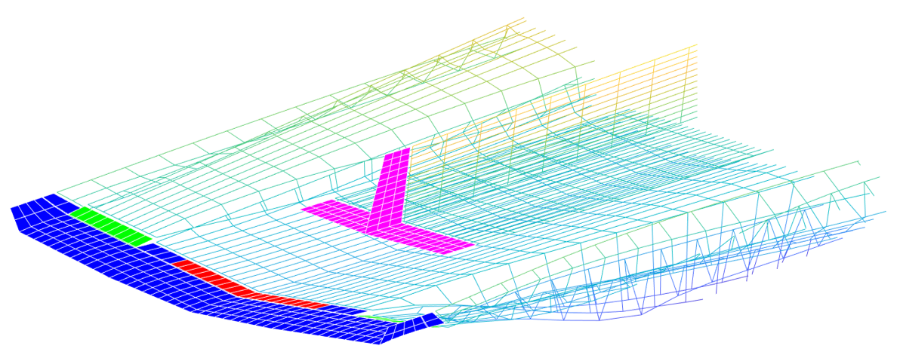

# VLM
This **V**ortex **L**attice **M**ethod code is a 3D unsteady aerodynamics solver relying on potential flow theory.

[](LICENSE)



## Building and testing
### Dependencies
The code requires:
- [CMake](https://cmake.org/)
- a C compiler ([GCC](https://gcc.gnu.org/), MSVC and [Clang](https://clang.llvm.org/) are supported)

Additionally, the code is wrapped in python. For the wrapper to be enabled, the code following dependencies are also required:
- [SWIG](http://www.swig.org/)
- [Python 3](https://www.python.org/)
- [NumPy](https://numpy.org/)
- [geoGen](https://github.com/acrovato/geoGen)
Note that geoGen should be located in a folder next to VLM.

#### Aptitude-based linux systems (Debian, Ubuntu)
Dependencies under Linux can be resolved by the Aptitude package manager.
```bash
sudo apt-get install git
sudo apt-get install cmake
# additional dependencies for python wrapper
sudo apt-get install python3 python3-dev libpython3-dev
sudo apt-get install python3-numpy
sudo apt-get install swig
git clone https://github.com/acrovato/geoGen # should be located next to VLM
```

#### OS X
Dependencies under MacOS can be resolved by the Homebrew package manager.
```bash
brew install git
brew install cmake
# additional dependencies for python wrapper
brew install python
brew install numpy
brew install swig
git clone https://github.com/acrovato/geoGen # should be located next to VLM
```

#### Windows
Windows does not feature a package manager by default. You will need to install or compile all the dependencies by yourself. Please refer to the documention of each package. Note however that CMake is usually bundled with Visual Studio 2017 and later.  
Yet another option is to use [MSYS2](https://www.msys2.org/) which provides a Linux-like environment. MSYS2 comes with the package manager pacman.
```bash
pacman -S git
pacman -S make
pacman -S mingw-w64-x86_64-tools-git
pacman -S mingw-w64-x86_64-cmake
pacman -S mingw-w64-x86_64-gcc
# additional dependencies for python wrapper
pacman -S mingw-w64-x86_64-swig
pacman -S mingw-w64-x86_64-python3
pacman -S mingw-w64-x86_64-python3-numpy
git clone https://github.com/acrovato/geoGen # should be located next to VLM
```

### Build and test
The build follows the standard "configure-compile-test" pattern.
First, get the code using git and enter the directory:
```
git clone https://github.com/ulgltas/VLM
cd VLM
```

#### Unix(-like) environments
For native Unix systems (Linux, OSX) simply open a terminal:
```bash
mkdir build && cd build
cmake [-DPYTHON_WRAPPER=OFF] ..
make
make install
ctest
```
For MSYS2, open a MSYS2-MINGW64 console:
```bash
mkdir build && cd build
cmake -C ../CMake/msys2.cmake [-DPYTHON_WRAPPER=OFF] ..
make
make install
ctest
```

#### Native Windows
Compiling the code **without the Python wrapper** is relatively straightforward. Make sure to disable the Python wrapper before running CMake, with option `-DPYTHON_WRAPPER=OFF`.
In order to use the wrapper, you also need to change the configuration to RELEASE and to provide CMake with the paths to Python and SWIG. The latter can be done by modifying the configurations:
```json
"cmakeCommandArgs": "-DSWIG_EXECUTABLE=C:\\PATH\\TO\\swig.exe -DPYTHON_EXECUTABLE=C:\\PATH\\TO\\python.exe"
```

## Running the code
By default the program is installed in the `bin` subdirectory and can be called with
```bash
bin/VLM path/to/input/file
```
If using the Python wrapper
```bash
python3 run.py path/to/input/file
```
This will automatically create its own workspace folder.
